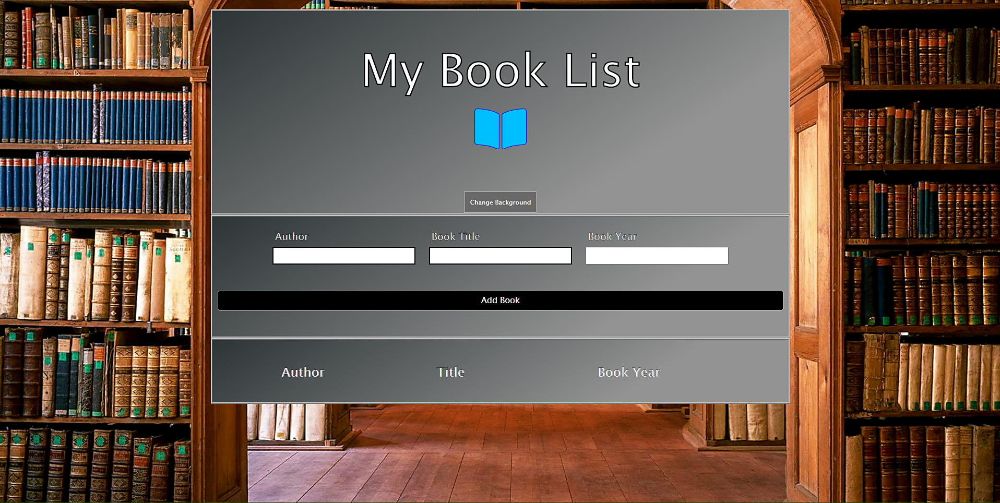
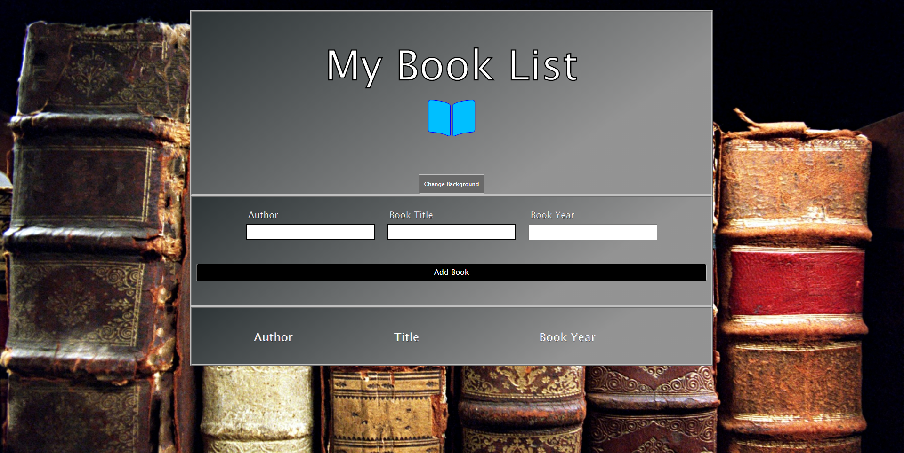
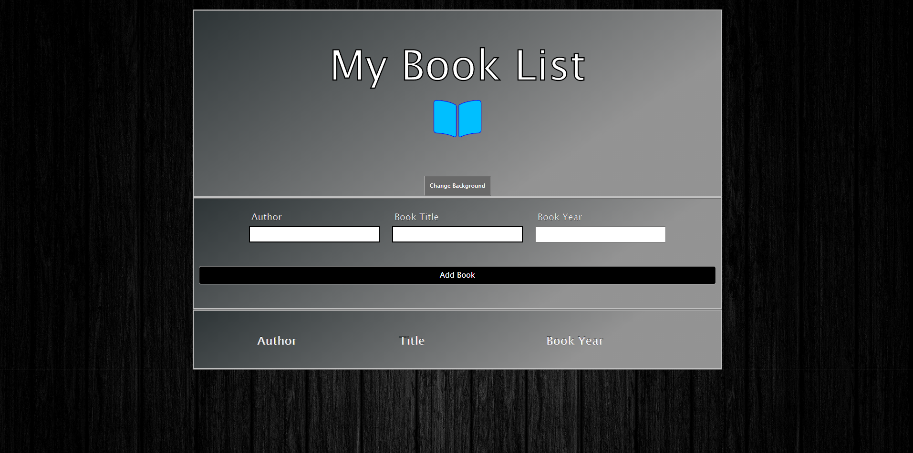

# My-Book-List
A Book List Application for storing a list of books you want to read. Enter Author, Book Title, and Book Year. 
Book info is stored in local storage, and listed on the bottom of the screen. 
You can add books to list, and remove books from list. 
Alerts will display for not entering all fields, or adding or removing books.
You can also change the background image of the application, there are three different backgrounds to choose from, using a dropdown menu.

Library Background

Old Books Background

Dark Wood Background

